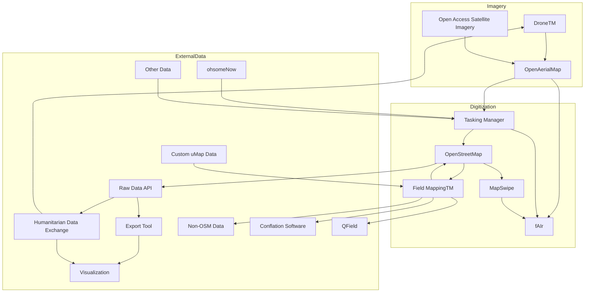

# Welcome to HOTOSM's Docs

📖 Welcome to the HOT Technical [documentation](https://docs.hotosm.org)
for all of our open-source tools.

This website is primary an index linking to the documentation for each
specific tool, including including setup and usage instructions, API
documentation, and product roadmaps.

This documentation is available under the `Projects` section in the sidebar.

The following additional documentation is provided:

- A high level overview of how our tools inter-relate and can be used to
  form an End-To-End mapping workflow.
- Information on our development practices at HOT.
- Our community code of conduct for contribution.
- Our privacy policy for most of our tools.
- Developer guidelines and information to assist the development workflow.

HOT is working towards the modularization of our code to improve
maintainability and implement an end-to-end user flow between multiple
tools. There is more info about [modularization](modules.md) of our code.

## The HOT Ecosystem of Tools

