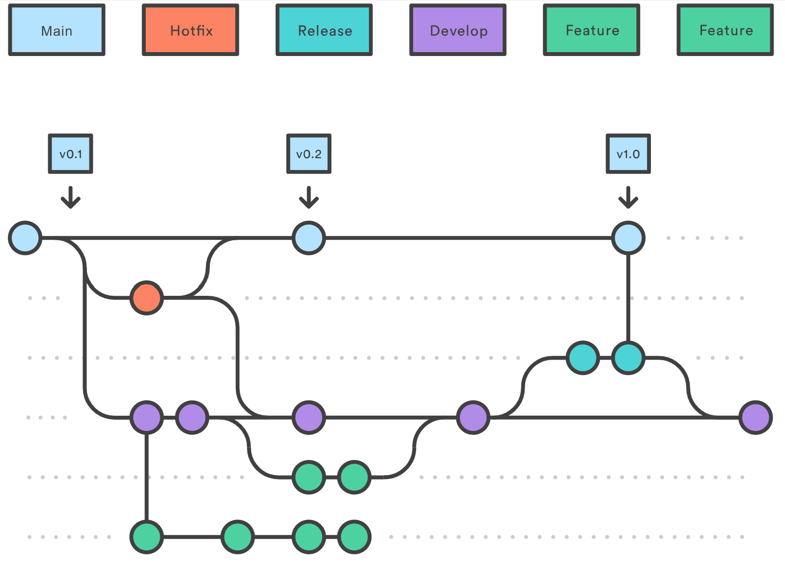
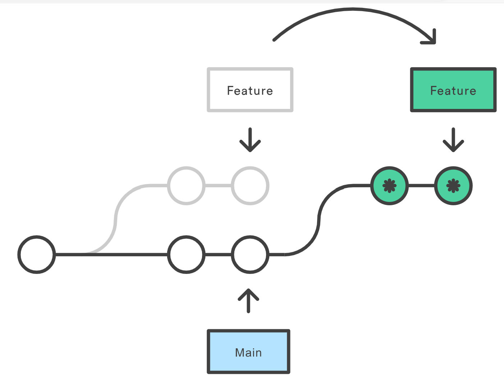

# Git and Pre-Commit Hooks

## Git - The Basics

Is is a tool we all know and love.

There are a few basic concepts that would be good to master.

### Development Lifecycle

The concept of Continuous Integration means that code is
continually developed and merged into a branch, for testing
or deployment.

CI/CD:

- **CI**: merge frequently into master.
  - Minimise merge issues from multiple collaborators.
- **CD**: deploy master frequently to production.
  - Regular updates for new features and bug fixes.

The primary branches, in order:

- **Development**: the branch that fixes or features are continually merged.
- **Staging**: where development branch fixes/features are grouped and tested
  together, with the intention to push to production once QA/QC passes.
- **Production**: where staging is stabilised and released at intervals as
  actual versions of your tool/software.

Additional supporting branches:

- **Fix**: fixes a bug or issue.
- **Feature**: add a new feature that didn't exist before.
- **Hotfix**: if an issue is found after a production release is made, a hotfix
  can be used to patch the production code.

### Git Flow

Git flow is a branching model.

The most basic version of this would be:

`feature` or `fix` --> `main` (production)


Adding in the extra steps of the described development lifecycle, we get:

`feature` or `fix` --> `development` --> `staging` --> `main` (production)



The number of additional stages can be flexible depending on requirements.

### Forking

To work on an open-source repository, generally you may not have
direct access to the repo from the start.

A common pattern is to make your own copy of the repo, a 'fork'
of it to work on.

Within this repo you create a new branch:

```bash
git checkout -b feat/some-new-feature
```

Then when you push the branch to your fork, generally a code hosting
platform like Github/Gitlab will prompt you to create a **Pull Request**
or **Merge Request** (the same thing).

### Pull Requests

A pull requests (PR) is used to merge the code from your forked
repository into the original code repository.

You should describe as accurately as possible what solution your
code provides, or feature it adds, and why it is necessary.

Ideally try to link it to an existing Issue in the repository issue board.

The maintainer of the repo will review your code, comment, and merge it in.

### Rebasing

This is often a scary concept to many.

It essentially re-writes the Git history on a branch, so
use with care.

**Use case**: sometimes your code gets out of sync with the target
branch you originally branched from.

For example you branched from `develop` to a branch `feat/some-new-thing`.

If you wish to pull in the latest updates from the `develop` branch into
your feature branch, you can do a rebase:

```bash
git checkout develop
git pull
git checkout feat/some-new-thing
git rebase develop
```

This will insert the updates **below** your code edits. I.e. the history
will show your commits on top of the most recent `develop` commits.

Visually this will be:



### Merge vs Rebase

- Use merge for feature → main (work finished).
  - When on develop use merge to include a (idealy finished) feature
- Use rebase for develop → feature (work in progress).
  - When on the feature branch use rebase from develop to include
    the latest changes
  - Regularly rebasing feature branches will keep them up to
    date with current features (either from main or develop).
  - This means that conflicts can be resolved gradually,
    instead of in one go during a merge.

[The Perils of Rebase](https://git-scm.com/book/en/v2/Git-Branching-Rebasing)

**The most important take away**: rebase is a powerful tool, but be wary using
it if you are collaborating with someone on the **same** feature branch.

If a teammate happens to rebase a branch that you are working on, the
easiest solution is to stash and reset to get the rebased edits:

```bash
git stash -u
git fetch origin feat/new-thing
git reset --hard feat/new-thing
git stash apply
git stash drop
```

### Anticipating a Merge

- Often in a developers workflow, they create on PR, then while waiting for review
  work on another PR.
- If `PR-2` relies on work from `PR-1` to be merged, this can be an issue.
- One approach to solving this dilemma is informally called 'anticipating a merge'.

#### Anticipating a Merge Workflow

1. Complete work on branch `PR-1` and push to create a PR.

2. Ensure you are on branch `PR-1`:

   ```bash
   git checkout pr-1
   ```

3. Create branch `PR-2` **based off** `PR-1`:

   ```bash
   git checkout -b pr-2
   ```

4. Build your feature on top of the code in `PR-1`.
5. Complete work on branch `PR-2` and push to create a PR.

**Important Notes**:

- The new `PR-2` will initially include the commits from `PR-1`.
- However, the commits shown in the PR changelog will disappear once `PR-1` is merged
  into the target branch (e.g. `development`).
- You should mention in the `PR-2` description that this PR 'relies on PR-1 being
  accepted and merged'.

#### Updating PR-1 While PR-2 Is In Progress

- You may encounter a situation where the review of `PR-1` takes some time.
- If `PR-2` makes progress, but the reviewer says that `PR-1` requires updates.
- In this case you have two options:
  - Merge `PR-1` and add the required updates to `PR-2`.
  - Update `PR-1` and merge, then rebase `PR-2` against the target branch.
