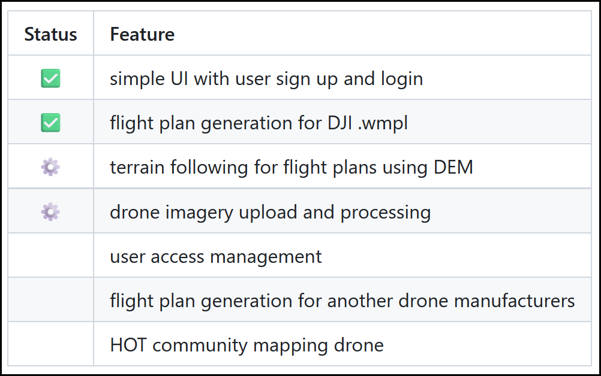

# HOT's Development Practices

This was last updated on 12/07/2024 and details our idealised
software development practices.

## Open-Source Model

- All code developed at HOT is open-source.
  - We rely heavily on community feedback to steer our development.
  - Contribution from **anyone** is welcome.
- We follow a git-flow, or fork-and-pr model:
  - Developers should create a fork of the repo they wish to modify.
  - Code is added to a branch inside **the fork**.
  - A pull request (merge request or PR) is made against the development
    branch of the original repository.
- Our code is generally licensed
  [AGPLv3](https://www.gnu.org/licenses/agpl-3.0.en.html)
  unless otherwise specified.

!!! note

    Some tools still use BSD-2-Clause:
    - Tasking Manager
    - Export Tool
    - Open Aerial Map

    [More details here](./dev-guide/repo-management/licensing.md)

## Defining **What** We Build

### Gathering Requirements

- When a project is first conceived, we have an idea of requirements / direction.
- Over time the requirements are dynamic and interative. We have two approaches.

#### Translating User Requirements Into Actions

- Our main feedback mechanism is through user testing. This should be done in
  collaboration with our hubs and partners to determine: what works well, and what
  doesn't. The general public will also use our tools and provide feedback.
- For field-based tools (FMTM, DroneTM), this would involve running mapping campaigns
  and gathering feedback from the teams involved.
- For desk-based tools (everything else), we mostly gather feedback through informal
  channels such as Slack.
- All tools have a public channel on Slack for discussion, providing feedback, and
  gathering requirements.
- Once we have gathered feedback, this should be divided up into actionable Git
  issues by the PO / Tech Lead and grouped into milestones or releases.

  > See the [milestones](#milestones) and [releases](#releases) sections
  > for details about grouping tasks into themes.

#### Gathering Direct Technical Feedback

- Users that are more tech-focused can create issues directly on our Git project.
- Discussions can also be used on our Git tracker for more general user input or
  feedback.
- Most often this will be bug reports, which should generally be high priority for
  the next release (or a [hotfix](#hotfixes) to production if `critical` priority).
- The PO / Tech Lead should triage tasks, assign priorities, and group into milestones
  or releases.

  > See the [issue labels section](#issue-tags) for details about priority assignment.

### Setting Priorities

- Generally bugs will take priority over new features, particularly those blocking
  the users workflow.
- Milestones for a tool will be assessed based on internal team discussion, in
  addition to public Slack and Git-based discussion.
- The determined priorities and milestones will be a tradeoff between:
  - Original vision and goals of the tool.
  - Most prominent user requests.
  - Global events and crisis response (activations).
  - Requirements from actively engaged stakeholders / organization.

> In future, we would like to better involve the public via a technical steering
> commitee or similar.

### Keeping Users Updated

Users can keep informed about ongoing tasks in various ways:

- Public announcements on [Slack](https://slack.hotosm.org) / blog posts on HOT's
  website, OSM Diaries, Dev.to, or other platforms.
- Releases on Github and included release notes.
- The overarching [roadmap](#roadmaps), showing progress for milestones and releases.
- Progress towards specific [milestones](#milestones), for new features.
- The [task tracker](#task-board) for individual issue progress (particularly
  for bugs).
- Any [discussions](#discussions) around particular features that have not been agreed
  upon and translated into an issue / milestone.

### Questions / Clarification

- HOT works fully in the open and is accountable for being clear about changes
  made to our tools.
- If clarity is poor about what the vision of our tools are, features we are planning,
  how we work, when requirements will be met, or anything else, then we have open
  channels of communication:
  - Via our public [Slack](https://slack.hotosm.org), either in channels related
  to a tool, or as a private message to a member of the tech team.
  <!-- markdownlint-disable -->
  - Via Github [issues](#issues-features) or [discussions](#discussions).
  <!-- markdownlint-enable -->
  - Direct message or email to the Product Owner or Tech Lead of the tool in question.
  - In the monthly 'Open Tech and Innovation Space' calls advertised on Slack.
  - In future, we also hope to have something akin to a 'Technical Steering Commitee',
    in which any tech-facing member of the public is welcome to provide input.

## Defining **How** We Build

### Git Repo Management

Management of tasks and code via Github.

#### Branches

- Generally our repos will have three key branches:
  - **dev**: the ongoing development to which PRs are made.
  - **stage**: optional branch where new features pass additional testing
    stages prior to deployment to the main website.
  - **main**: the code that is currently deployed to the main website.

#### Issues \ Features

##### Issue Tags

- Label / tag issues where appropriate, for example as `backend` or `frontend`.

- Priorities can be assigned:.
  - `priority:critical`: blocking current tasks or user workflow.
  - `priority:high`: should be addressed as a priority.
  - `priority:low`: backlog of tasks that will be addressed in time.

- Difficulty can be **estimated** (and may not be accurate):
  - `effort:low`: small task, likely a few hours.
  - `effort:medium`: larger task, may take a day or two.
  - `effort:high`: a broader scope task with unclear timeline.
    > Ideally there should not be many tasks with `effort:high`.
    > If there are, consider breaking them down to smaller tasks.

- The testing status can be tracked:
  - `testing:ready`: the issue has been fixed and is ready to test.
  - `testing:fail`: the issue was not fixed as intended and requires additional
    work from the developer.
  - The `testing:xx` label can be removed when an issue is closed.
    > Note that `testing` is used as a simpler alternative to project management
    > terminology such as `quality control` or `quality assurance`.

- Issues marked `good first issue` are approachable to newcomers in the repo.
  - Ideally the repo should always have a few low priority `good first issue`
    tags to help foster open source contribution / onboarding.

!!! note

    To attach labels to an issue, the Github user requires at least
    `triage` level permission for the repo.

    This can be tracked at a repo level with a `contributors` group, including
    those that have contributed regularly to include them in the development flow.

##### Issue Assignment

- Assign issues to the dev who will work on it.
- Issues can be assigned in advance if the devs is known.
- Devs can self-assign tasks.

#### Writing & Merging Code

PR = pull request, merge request, or similar terminology simply meaning to merge
code!

##### PR Drafts

- Create a draft PR for works in progress.
- Push as early as possible to draft, especially if there is a chance you
  may get sidetracked on other work (so another dev could feasibly pick
  up where you left off).

##### PR Assignment

- Assign yourself if you are working on the issue.
- Assign another dev if you need to pass off the development to them.
- The re-assigned dev can then assign the task back to the original dev for
  validation.

##### PR Review

- Any developer can review a PR, **as long as one dev reviews** prior to
  merge.
- In addition to a sanity check, a review should ideally be a **technical**
  ideally suggesting feedback where code could be reused, best practices that
  should be used, etc.
- **Assign** devs for review - frontend can review backend and vice versa.
- Once review is complete and the PR is out of draft state, then **any dev can
  merge**.

!!! note

    Once a PR is merged, the merged should ensure that the
    `testing:ready` label is applied to the relevant issue, if required.

##### Linking Issues

- Issues can be linked via either:
  - `fixed #123` syntax to automatically close the issue on merge.
  - `related #123` syntax to allow the Product Owner / Manager close the issue
    manually once they are satisfied the issue is resolved fully.
- Generally the second approach is preferred

#### Marking Issues As Solved

- Once merged, code should be deployed automatically from the `dev` branch
  to the `dev` server.
- This allows for the Project Owner / Manager to thoroughly test the changes
  and either close the issue, or add the `testing:fail` tag.
- Once closed, this will be reflected on the milestone percentage, roadmap
  progress, and task board complete tasks.

!!! note

    Note the distinction here between the **technical code review** and the
    the review of the solution from a **user perspective** via testing.

### Project Management

Still related to Github, but describing higher level project management
and project direction.

#### Milestones

- Encapsulates a set of issues into a logical bigger task, with or without
  an assigned deadline.
- Discussed in team meetings and decided on via priorities.
- Project Owner (PO) decides on priorities, tech lead decides on which tasks
  are required to achieve that goal.
- Milestones are grouped into a release, which has a set deadline.

#### Releases

- A release encompasses multiple milestones, plus additional bugfixes
  and minor improvements.
- Releases are tracked on the roadmap and have an _approximate_ deadline.
- Ideally releases should be around once a month at minimum, to regularly
  deliver incremental updates to the user (~agile project management).

#### Roadmaps

##### Technical Roadmap

- Higher level roadmap based on releases and milestones.
- Managed on Github, linked in the README.
- The roadmap should include:
  - Milestones (with optional dates) and issues linked to releases.
  - Releases labelled over the top, showing the anticipated next release date.

Example (from FMTM):


##### User Roadmap

- Most users do not want to delve into Github roadmaps and issues.
- A simpler user-centric roadmap can be written in simple Markdown
  table syntax.
- The table is a chronological timeline, divided into three categories:
  - ✅ for done tasks
  - ⚙️ for ongoing tasks
  - [no emoji] for upcoming tasks

Example user roadmap (from Drone TM):



!!! note

    Previously we used to use a three-column table with categories:
    - In Progress
    - Next
    - Future

    However after agreeing as a team, we decided to streamline the approach to
    be less verbose, and to better show the ordering of priorities, as above.

    The user-story based wording was also partially replaced using emojis for
    the context of each feature (for brevity when used in a README file / front page).

#### Task Board

- An optional stage to easier visualise developer time.
- Should be as automated as possible:
  - Issues added to a project are added to the backlog.
  - Issues assigned to a dev are moved to 'In Progress'.
  - Issues labelled with `QA Ready` are moved to 'Review'.
  - Issues completed should be moved to 'Complete'.
- By automating this processes, the developer does not have duplicated work.
- Ideally we can keep track of which developer is working on
  what task.
- This becomes especially important when we also have outside collaborators.

Example:


#### Discussions

- To discuss more general topics in the public, so that anyone can contribute.
- Partly used to document the design decisions we have taken.
- Tag people specially for input, as it makes them more likely to add ideas.
- We can also use these for the staging server tests on each release cycle,
  e.g. <https://github.com/hotosm/field-tm/discussions/1335>

#### Release Notes

- No technical details, move those to a dropdown in markdown:

Example:

    ```md
    <details>
      <summary>Technical Summary</summary>
        * Add healthcare form category & minor fixes by @spwoodcock in https://github.com/hotosm/field-tm/pull/1555
        * Fix/requested page redirection by @NSUWAL123 in https://github.com/hotosm/field-tm/pull/1559
        * Test coverage for update project route by @azharcodeit in https://github.com/hotosm/field-tm/pull/1557
    </details>
    ```


- Higher level info on bugs fixed, new features added, things improved.
- Add screenshots throughout.

### Deployment Flow

These stages go in order, from local development, through to production deployment.

#### Local Development

- Devs develop features on their local instance.
- Use `docker-compose.yml` setup for testing.
- Once feature and testing complete, make a PR to the `dev` branch.

#### Development Deployment

- Once a PR is approved, it is merged to `dev`.
- This triggers a workflow to automatically deploy the code changes on the dev server.
- The purpose of this stage is for:
  - Fast CI, i.e. the developer sees their code in action quickly.
  - Easy QA tests by the project manager on the dev server.

#### Staging Deployment

- The purpose of this step is to regularly release versions of the software that
  power users (and the project owners) can test.
  - Anyone who doesn't mind occasional breakage is welcome to use this server publicly.
- At a set interval (approx bi-weekly), the updates made on `dev` are merged into
  `staging` for feature stabilisation.
  - This can be done via PR, although sometimes there may be merge conflicts to resolve.
  - Alternatively, the branch can be reset to the latest `dev` and built upon:
    `git reset --hard origin/dev`
- Once merged, the functionality is thoroughly tested and patched (if required).
  - Patches can either me made on `dev` and merged into `staging`.
  - Or be made directly to `staging` if there branches have diverged significantly.
- Once approved, the `staging` branch auto-deploys to the staging server.

#### Production Deployment

- The staging server instance is thoroughly tested by the product owner, and
  bug reports filed.
- The release is hardened into longer interval (approx bi-monthly) production releases.
- A PR is made from `staging` to `main` branch.
- Once approved and the code merged, a Github **release** is made.
- A release is available on Github, including all relevant release notes for
  what has been updated.
- The **release** will trigger the workflow to deploy to the production server.

##### Hotfixes

- If an issue is found after a production release is made, a hotfix can be used to
  patch the production code.
- There are two methods to do this:
  - If the `dev` and `main` branches have diverged significantly, the hotfix can
    be made as a PR directly to `main`, then reconciled later with `dev`.
  - Otherwise, the fix can be made as a PR to `dev`, then `cherry-picked` upstream
    through `staging` then to `main`.

##### Security Vulnerabilities

- Vulnerabilities in software are an inevitability and may be reported by
  users, developers, or automated CI tools.
- They will typically be referenced by a Common Vulnerabilities and Exposures  
  (CVE) reference ID, which can be looked up in various CVE tracking websites.
- Once a vulnerability is reported and verified, actions can be taken:
  - **System dependencies**: generally updating a container image version,
    or rebuilding the image should fix these, as vendors update regularly.
  - **Package dependencies**: an issue in your bundled sub-dependencies
    may be fixed by updating the package version to the latest. CVEs are
    generally fixed quickly by the package maintainer.
  - **In our repo code**: these may be picked up by static and dynamic code
    scanners and are generally fixed as part of the pre-commit or PR
    review process (CI workflows).
- Fixes should be pushed through to production as soon as possible, as a
  `hotfix` branch including the updated image/package version or code.

#### Other: Feature Demo Releases

- A feature demo release is a throwaway instance of the tool with a particular purpose.
- Functionality is developed here for various reasons:
  - Specific updates for a single project that won't be used elsewhere.
  - Very fast updating of the server, without interfering with the typical release
    flow.
- The key point is that these branch instances are **single use** and will be
  **shut down** once the project has ended.
- The easiest approach is probably to:
  - Create and login to a server.
  - Clone the repo and checkout to the feature branch `feature-demo/some-feature`.
  - Run the commands to build and run the tool.
- Alternatively, a workflow can be made to auto-deploy:
  - Triggering on a branch naming convention: `feature-demo/some-feature`.
  - The user will have to enter an SSH key into the Gitlab secrets.
  - The workflow will deploy to the server remotely when the branch is pushed to.
  - This approach is less preferred, as the user requires write access to the
    Github repo.

## Note About Linear

- The information above is due to an overhaul!
- We have decided to use Linear as a project management tool,
  allowing for easier thematic linking of tasks across projects.
- The Linear tool itself is only accessible by HOT staff, but
  absolutely everything there is synced publicly and bi-directionally
  to Github!

### Issue management

- **Issues**: lowest level, per repo.
  - Each issue should have a label `repo:repo-name` to allow for
    easier sorting in Linear (a small workaround to ensure we
    remain on the 'free' tier).
  - Issues and all info are synced automatically from Github,
    but the only manual step we need is adding the mentioned
    label.
  - Developers should interact and comment on Github issues.
  - Managers can track progress, group issues, and make
    dashboards via Linear.
  - 💡 Example: Add additional endpoints to backend for gathering
    user stats on a dashboard.
- **Milestones**: these are an _optional_ part of the workflow
  capturing multiple issues that have a specific _deadline_ and
  purpose, e.g. linked to a specific contract.
  - 💡 Example: Add badges to user profile, based on stats
    generated in each mapping category. Due 29/10/2025.
- **Projects**: a grouping of issues and milestones around a
  particular theme, i.e. essentially an epic in other tools.
  These can include issues from multiple repos, if they tie
  together.
  - 💡 Example: Super Mapper feature in Tasking Manager.
- **Initiatives**: a very high level goal we wish to achieve,
  encompasing multiple projects.
  - 💡 Example: Better user engagement by providing useful
    stats and better tracking of mapping progress across
    projects.

### Public roadmap

- We have a public roadmap linking all tools together under
  [https://hotosm.steelsync.io/tech-roadmap](https://hotosm.steelsync.io/tech-roadmap)
- This is made using a tool called SteelSync (paid unfortunately,
  but cheap), that gathers data from the Linear API and easily
  creates a public dashboard.
- We chose the approach to save the overhead of developing
  our own roadmap page using the Linear API.

### Feature requests

- Technical users can still make issues and bug reports via
  each Github repo.
- For general user requests (public, or internal to HOT),
  we can all use the 'Request' button available on the
  mentioned public roadmap page above.
- Each request will create an issue in Linear. The tech team
  will triage and add the issue to the relevant Github code
  repository, then place within a project / initative with
  timelines.
