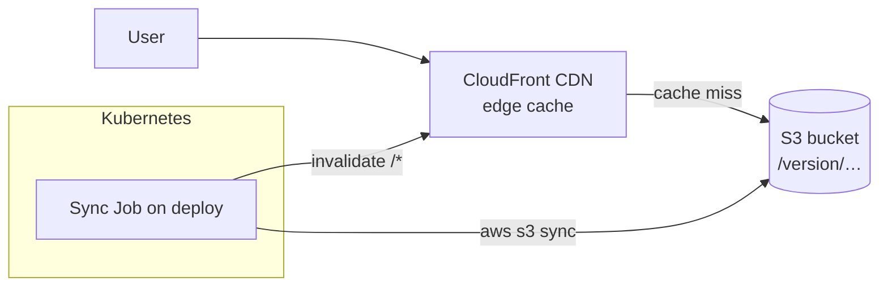

# Deploying Frontends Via S3 & CloudFront

One of our two [frontend deployment options](./deployment-process.md#frontend-deployment-options).
Instead of the backend serving the frontend, the built `dist` is synced to an
**S3 bucket** with **CloudFront** as a CDN cache on top.

**Why:** AWS has edge locations globally, so users get a fast cache hit close
to their location regardless of where the cluster runs. The tradeoff is a small
amount of AWS vendor lock-in - a judgement call for the best frontend
experience. Drone TM uses this in production.



## How it works on each deploy

When the Helm chart is deployed with `frontend.mode: cloudfront`, ArgoCD runs a
**sync-hook Job** (`cloudfront-deploy-job`) _after_ the new backend is live. The
Job:

1. Builds the frontend `dist` (an init container injects runtime env such as
   `VITE_API_URL`).
2. `aws s3 sync`s the assets to `s3://<bucket>/<version>/`. Hashed assets get a
   long immutable cache; `index.html` / `config.js` are re-uploaded with a short
   (60s) cache so new deploys are picked up.
3. Points the CloudFront distribution's **origin path** at the new
   `/<version>/`.
4. Runs `aws cloudfront create-invalidation --paths "/*"` so users get fresh
   content immediately.

Because assets live under a `/<version>/` prefix, a **rollback** is just
re-deploying an older chart version - the Job repoints the origin at the old
prefix.

## One-time setup

Steps 1–2 are done **once** when onboarding an app to CloudFront. After that,
the deploy Job above handles everything automatically.

### Step 1: The role for the sync Job (IRSA)

The Job needs AWS permissions to write to S3 and manage CloudFront, **without**
static credentials. We use **IRSA** (IAM Roles for Service Accounts):

- The chart creates a Kubernetes `ServiceAccount` annotated with the role ARN
  (`eks.amazonaws.com/role-arn`).
- EKS injects `AWS_ROLE_ARN` and `AWS_WEB_IDENTITY_TOKEN_FILE` into the pod. The
  token file is a short-lived, cluster-signed service-account JWT.
- The AWS SDK/CLI exchanges that token via STS to assume the role - temporary
  credentials, auto-rotated.

Create an IAM role with a trust policy for the cluster's OIDC provider, then
attach a policy like the following (see also [AWS IAM](./aws-iam.md)):

```json
{
  "Version": "2012-10-17",
  "Statement": [
    {
      "Sid": "S3",
      "Effect": "Allow",
      "Action": [
        "s3:PutObject",
        "s3:GetObject",
        "s3:DeleteObject",
        "s3:ListBucket",
        "s3:PutBucketPolicy"
      ],
      "Resource": [
        "arn:aws:s3:::dronetm-prod-frontend",
        "arn:aws:s3:::dronetm-prod-frontend/*"
      ]
    },
    {
      "Sid": "CloudFront",
      "Effect": "Allow",
      "Action": [
        "cloudfront:GetDistribution",
        "cloudfront:GetDistributionConfig",
        "cloudfront:UpdateDistribution",
        "cloudfront:CreateInvalidation",
        "cloudfront:ListDistributions",
        "cloudfront:CreateDistribution",
        "cloudfront:CreateOriginAccessControl",
        "cloudfront:ListOriginAccessControls"
      ],
      "Resource": "*"
    }
  ]
}
```

### Step 2: The CloudFront distribution

Create the distribution **manually in the AWS console** (one-time), pointing it
at the S3 bucket as origin. Recommended config:

- An **Origin Access Control (OAC)** so only CloudFront can read the bucket
  (plus a bucket policy granting the OAC `s3:GetObject`) - the bucket stays
  private.
- **SPA error handling**: map `403` and `404` responses to `/index.html`
  (200) so client-side routing works.
- Your domain **alias** (e.g. `drone.hotosm.org`) and its ACM certificate
  (must be in `us-east-1` for CloudFront).

!!! note

    The deploy Job *can* create the distribution automatically if none is
    found (it has the `CreateDistribution` permission above), but we create it
    manually so the domain, certificate, and price class are set deliberately.
    The Job then just updates the origin path and invalidates on each deploy.

## Configuration

Point the chart at the role and bucket via the app's `values.yaml` in
[k8s-infra](https://github.com/hotosm/k8s-infra). Example (Drone TM prod):

```yaml
frontend:
  mode: cloudfront
  runtimeEnv:
    VITE_API_URL: https://api.drone.hotosm.org
  cloudfront:
    roleArn: arn:aws:iam::<account>:role/dronetm-prod-frontend-cloudfront-deploy
    region: us-east-1
    s3Bucket: dronetm-prod-frontend
    aliases: [drone.hotosm.org]
    acmCertificateArn: arn:aws:acm:us-east-1:<account>:certificate/<id>
    priceClass: PriceClass_All
```

The distribution **ID is not stored** - the Job finds the distribution by its
S3 origin domain.

## Summary

- The frontend ships as a container image with the built `dist` inside.
- On deploy, ArgoCD runs a Job that syncs the `dist` to S3 (under a versioned
  prefix), repoints CloudFront, and invalidates the cache.
- Auth is via IRSA - no static AWS keys in the cluster.
- Rollback = redeploy an older version; the Job repoints to the old prefix.
