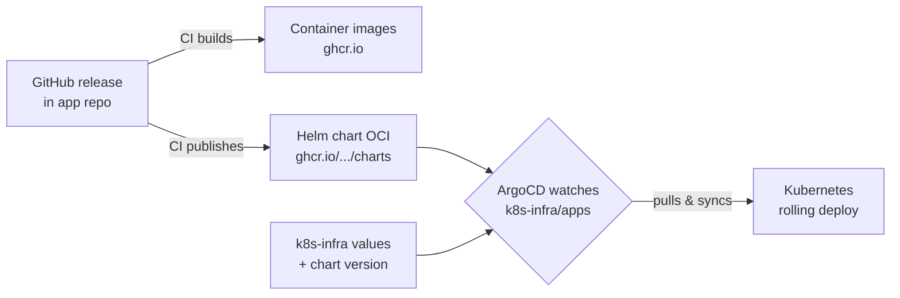
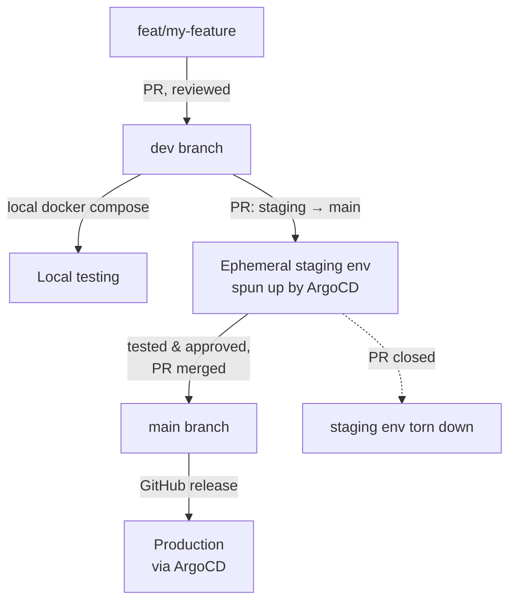

# Our Deployment Process In Kubernetes

How our applications get from a developer's laptop into production on
Kubernetes. This applies to tools deployed via our
[k8s-infra](https://github.com/hotosm/k8s-infra) cluster (e.g. Drone TM,
the HOT website).

The key idea: **we do not push deployments from CI**. Instead we use a
**GitOps pull model** with [ArgoCD](https://argo-cd.readthedocs.io).
ArgoCD watches our config and pulls the desired version into the cluster.
CI's only job is to build artifacts (container images + a Helm chart);
ArgoCD does the deploying.

## Packaging Our Apps: The Helm Chart

- Each app repo contains a Helm chart (in `chart/`) that packages the
  backend, frontend, and supporting resources (databases, caches, jobs).
- Cutting a **GitHub release** triggers two things via our
  [reusable workflows](https://hotosm.github.io/gh-workflows/):
  1. Multi-architecture **container images** are built and pushed to
     `ghcr.io` (a workflow is used because it builds multi-arch images easily).
  2. A `just chart publish` recipe packages the Helm chart and pushes it as
     an **OCI artifact** to `ghcr.io/hotosm/charts/<app>`.
- The image tag and chart version are kept **in sync** (both driven by the
  release version) for simplicity. See
  [Creating Releases](../dev-guide/repo-management/creating-releases.md).

## Frontend Deployment Options

The chart supports two ways to ship the frontend.

### CloudFront + S3 (our default)

We use this for all our own deployments, as we run on AWS. The frontend `dist`
is synced to an S3 bucket with CloudFront on top as a global CDN cache, giving
users a fast response wherever they are (`frontend.mode: cloudfront`).

See [CloudFront + S3 frontends](./cloudfront-s3-frontends.md) for details.

### Bundled with the backend (for self-hosters)

We provide this option for self-hosters and other orgs that want to deploy
without AWS. The frontend `dist` is served directly by the backend, so it runs
as a single service (`frontend.mode: bundleWithBackend`), for example Django
via [Whitenoise](https://whitenoise.readthedocs.io), or a FastAPI backend
serving the built assets.

## The GitOps Model (ArgoCD)

All cluster state lives in the [k8s-infra](https://github.com/hotosm/k8s-infra)
repo. ArgoCD continuously reconciles the cluster to match it:

- **`apps/`** - production `Application` manifests. ArgoCD auto-syncs these.
- **`apps/staging/`** - staging `ApplicationSet`s that spin up **ephemeral**
  environments from open pull requests.

Each app manifest points at three sources: the **OCI Helm chart**, a
**`values.yaml`** in k8s-infra (environment config), and any extra
**k8s-infra resources** (sealed secrets, etc.).

## Environments

### Development

- Devs build features on `feat/*` branches and test **locally** with
  `docker compose`.
- Merged into `dev` via reviewed PR.
- A shared dev server / cluster is **not yet set up** (TBC).

### Staging (ephemeral, PR-driven)

Staging is **not a permanent server** - it exists only while a release is
being tested.

- When ready to release, open a **PR from `staging` → `main`** (some repos use
  `stage`). This is what triggers staging, not merging.
- ArgoCD's `ApplicationSet` PR generator detects the open PR and spins up a
  dedicated env (namespace `<app>-staging`), built from the **PR's own commit**
  (chart + `sha-<commit>` image), with a lightweight config (single replica,
  bundled ephemeral Postgres).
- Release testing and hardening happen here. Push more commits to `staging` and
  the env rolls automatically.
- When the PR is **merged (or closed)**, the staging env is **automatically
  torn down** (the namespace and secrets persist for next time).

!!! note

    Only apps that need it have staging configured today (e.g. the website,
    fAIr). Not every app has a staging `ApplicationSet`.

### PR Demo (optional, not yet enabled)

The same ArgoCD PR-generator mechanism used for staging can give **every PR its
own temporary environment and URL**, for isolating a specific feature under test.

- Add an ArgoCD `ApplicationSet` that scans a repo's open PRs and spins up a
  per-PR env (e.g. `pr-123.<app>.hotosm.org`), torn down when the PR closes.
- We **don't enable this yet**, to save cluster resources, but it's an easy
  option to switch on for an app when a feature needs separate review.

### Production (GitOps pull)

1. Once staging looks good, **merge the `staging` → `main` PR**.
2. Cut a **GitHub release** on `main`. CI builds the images and publishes the
   Helm chart (versions in sync).
3. ArgoCD picks up the new chart. There are two promotion styles:
   - **Auto-track** (`targetRevision: "*"`, e.g. Drone TM): ArgoCD deploys the
     newest published chart automatically - the release _is_ the deploy.
   - **Pinned** (`targetRevision: 1.2.3`, e.g. the website): bump the version
     in the app's `apps/*.yaml` via a small PR to k8s-infra to promote it.
4. Within a few minutes ArgoCD performs a **rolling deploy** (new pods up and
   healthy before old pods shut down).

To **roll back**, point `targetRevision` at a previous chart version in
k8s-infra. See [Creating Releases](../dev-guide/repo-management/creating-releases.md)
for the step-by-step and rollback details.
