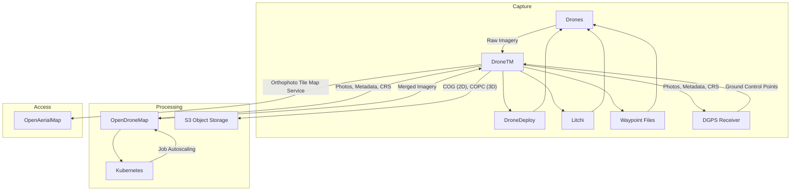
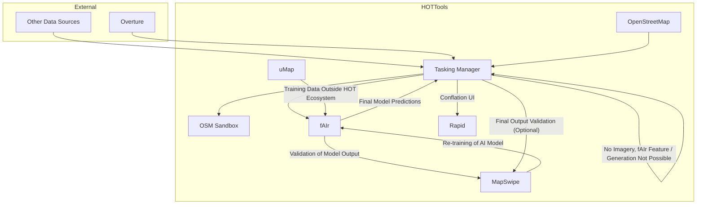

# How does everything fit together?

The HOT Tech Team is working to improve the user experience across
multiple tools, and working towards an end to end data flow between
projects.

During disaster response, or a humanitarian mapping campaign, a project
manager or mapper may require:

- High quality base imagery.
- Digitized map features, derived from this imagery.
- Field-verified information about these features.
- Data exported in a useful format for further analysis.

The goal of our proposed
[E2E Flow](https://hotosm.github.io/e2e-mapping) is to fill in these
gaps to aid an effective response.

## E2E

### 1. Imagery Collection

### 2. Digitization

## Block Model Diagram

## Overall Architecture

## Old HOT Ecosystem Digram (2023)

